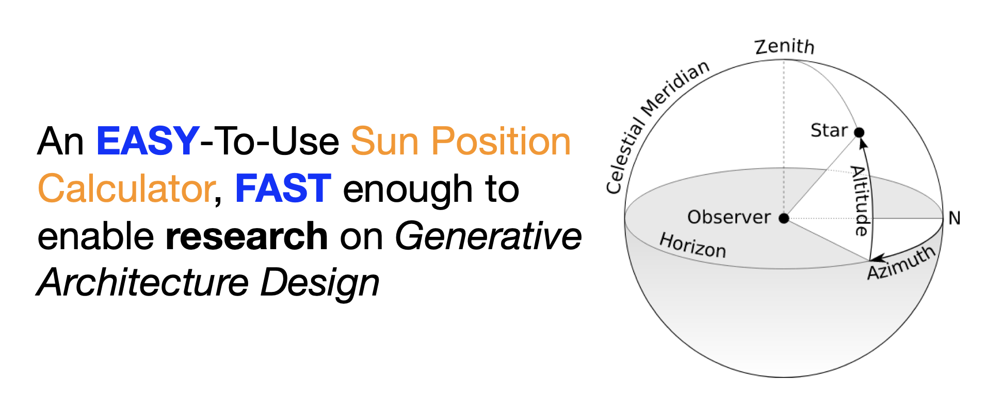

<!-- Add buttons here -->


# Motivation

When tring to build an autonomous [site planning](https://en.wikipedia.org/wiki/Site_plan) model, I was shocked by the _backwardness_ of [sunlight analysis](https://www.level.org.nz/site-analysis/sun/) technology in the Chinese real estate design industry:

1. all available products are distributed as **close-sourced** "plugins" [用过的都知道~] in commercial desktop softwares, such as [AutoCAD](https://www.autodesk.com.cn/products/autocad/overview) and [Rhino Grasshopper](https://www.grasshopper3d.com/). Worse yet, many are **slow and not upgraded** for years.

2. no **python** package available makes it impossible to utilize DNN models, which nowadays are usually implemented on either [tensorflow](https://www.tensorflow.org/) or [pytorch](https://pytorch.org/), _and nothing else_.

The problem of sun position involves not only **solar astronomy** about space-time transformation between celestial and topocentric coordinates, but also  **convention** in specific industries. It needs great effort for a single person to comprehend related knowledge scattered in various papers and documents. Thus FSEG is initiated as:

1. a **container** of algorithms and know-how on _sun position_ in different industries
2. an easy-to-use API to relieve users from underlying astronomical and computational complexities

Please visit [Homepage](https://mikesongming.github.io/SE-Geometry/index.html) for usage and contributing details.

> Appended a detailed internal [analysis [吐槽]](docs/dr_wang.pdf) on the industry by my friend _Dr. Wang_ , any citation or redistribution of it is fully permitted! ^_^

# Installing

FSEG can be installed via PyPi by:
```sh
pip install fseg
```

To build by source, call a [PEP517](https://peps.python.org/pep-0517) compliant build-system by:
```sh
python -m build
```

For more details, please visit [INSTALLATION](https://mikesongming.github.io/SE-Geometry/user-guide/install/).

# Contributors

**众人拾柴火焰高** :

- Mike Song, <gnosoir@hotmail.com>

More contributors and sponsors are welcome. Please visit [CONTRIBUTING](https://mikesongming.github.io/SE-Geometry/about/contributing/) for details.


# License

To aggregate expertise and efforts from both uncommercial and commercial entities, FSEG adopts the [LGPLv2.1 License](LICENSE).

本项目版权采用[LGPLv2.1](LICENSE)开源协议，意味着基于本项目的库文件可以进行任意开源或者闭源软件的开发，但是对本项目的**任意修改**需要采用同样的协议开源。

如有疑问，请联系 gnosoir@hotmail.com 。
